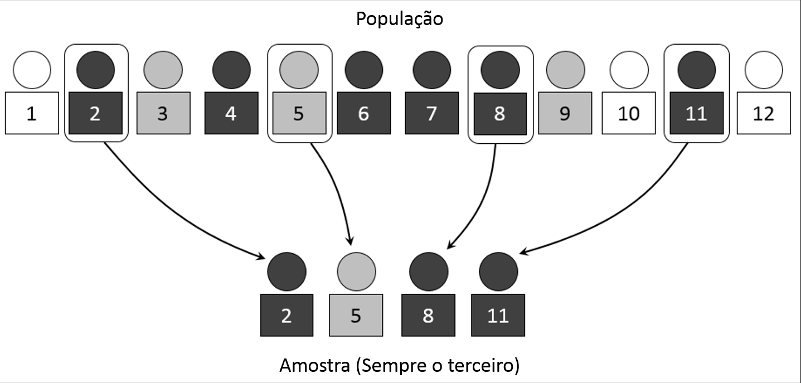
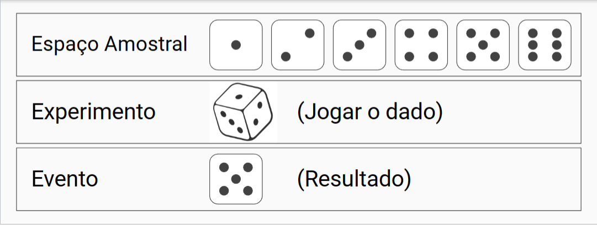
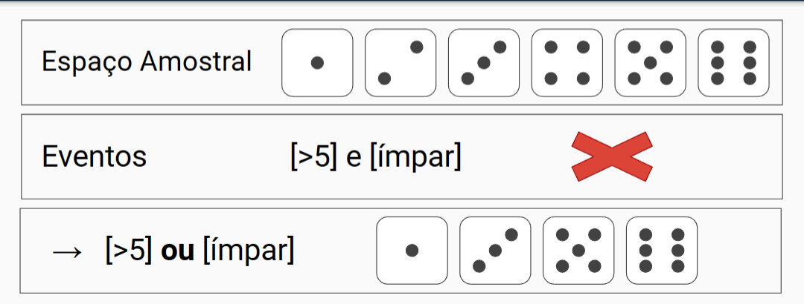
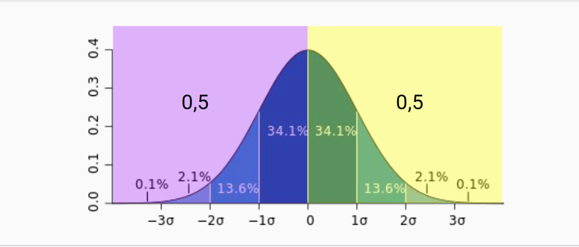
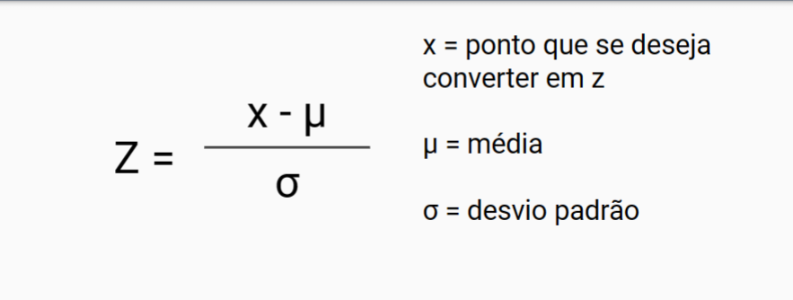
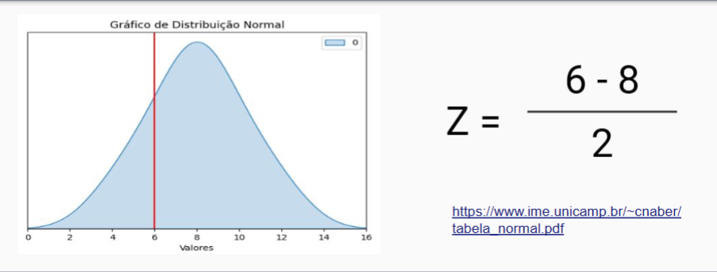
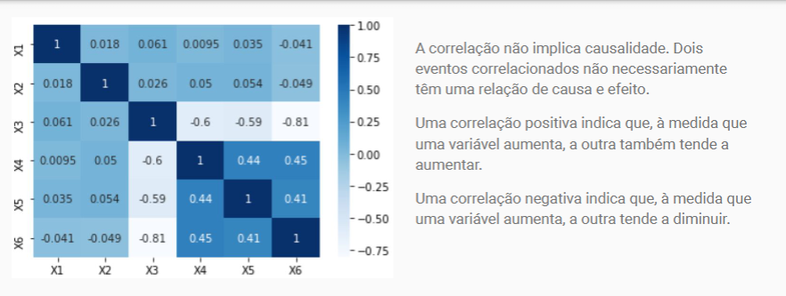
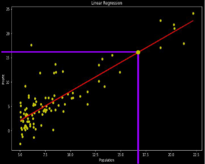

# Revisão últimas aulas

## **Estatística Inferencial**

Tirar conclusões e a partir de generalizações de dados amostrais.

## **Métodos de Amostragem**

### _Amostra Aleatória Simples_

todos os elementos da população têm igual probabilidade de pertencer à amostra, e todas as possíveis amostras têm também igual probabilidade de ocorrer (aleatoriedade).

### _Amostra Estratificada_

Divisão da população em estratos e seleção de amostras de cada estrato (cada tipo de população).

Exemplos de estratos (raça, religião, escolaridade) e representatividade.

## **Reposição**

### _Amostra Com Reposição_

O mesmo elemento pode ser selecionado várias vezes em uma população (anti dopping, por exemplo).

### _Amostra Sem Reposição_

Ao ser selecionado, o elemento não
poderá ser selecionado novamente.

## **Probabilidade**

Qual é a chance que um evento ocorra?

Toda probabilidade calculada deverá resultar em um número entre 0 e 1, sendo:

Probabilidade 1 = Evento
Certo

Probabilidade 0 = Evento
Impossível

Ao jogar o dado, qual a probabilidade do resultado ser 5?

Resposta: 1/6 = 0,16% de chance

Espaço amostral = 6 (6 possíveis resultados)

Evento = 1 (1 resultado, '5')

## **Eventos Excludentes**

Eventos excludentes, também
conhecidos como eventos mutuamente exclusivos, são eventos que não podem ocorrer simultaneamente.

_Cálculo_

A probabilidade de eventos
excludentes é calculada pela **soma
das probabilidades** individuais de
cada evento

Probabilidade de ser maior que 5:

1/6

Probabilidade de ser ímpar:

3/6

Somar apenar os divisores (1 e 3 neste caso)

1/6 + 3/6 = **4/6** = **0,6**

## **Eventos Independentes**

_Definição:_ Eventos independentes são
eventos em que a ocorrência de um
evento não afeta a probabilidade de
ocorrência de outro evento.

_Cálculo:_ A probabilidade de eventos independentes é calculada pela multiplicação das probabilidades individuais de cada evento.

Número do dado cair > 3
4, 5 e 6 = 3

Número do dado cair ímpar
2, 4, 6 = 3

_Cálculo:_ Multiplicar os dois

3/6 x 3/6 = **9/36** = **0,6**

## **Eventos Dependentes**

_Definição:_ Eventos dependentes são eventos em que a ocorrência de um evento afeta a probabilidade de ocorrência de outro evento.

\*Cálculo:8 A cada evento diminui-se o espaço amostral.

_Exemplo de cartas:_

Q, J, K e A: espaço amostral = 4

escolheu uma carta e caiu Q, espaço amostral = 3

## **Distribuição**

Uma distribuição é uma função que descreve a probabilidade de
diferentes resultados possíveis em um determinado
experimento ou fenômeno. Ela fornece informações sobre a
frequência com que cada resultado ocorre e como eles estão
distribuídos.

### _Distribuição Normal_

- Forma de sino
- Dados até 3 desvios padrão da média

_Cálculo:_

## **Correlação**

A correlação é uma medida estatística que descreve o grau de relação entre duas variáveis.

Ela indica a direção (positiva ou negativa) e a força dessa relação.

O coeficiente de correlação varia de
-1 a +1.

- Valores próximos de -1 indicam uma correlação negativa forte.
- Valores próximos de +1 indicam uma correlação positiva forte.
- Um valor próximo de 0 indica uma correlação fraca ou inexistente.

## **Regressão Linear**

A regressão linear simples é um método estatístico que modela a relação entre duas variáveis:

- Uma variável independente (X) e uma variável dependente (Y).

- É usada para prever ou estimar o valor de Y com base nos valores de X.
- _Variavel Independente:_ Previsor
- _Variavel Dependente:_ Classe
- **X:** em baixo, horizontal
- **y:** subindo, vertical

# Revisão primeiras aulas

## CIENCIA DE DADOS

É coletar e organizar dados pra gerar informações e conhecimento, por meio de tecnicas e ferramentas de processamento de dados.
Para tomada de decisões e solução de problemas.

    -COLETA DE DADOS
    -ANALISE DE DADOS
    -VISUALIZAÇÃO DE DADOS
    -PLANEJAMENTO DE ESTRATEGIA
    -TOMADA DE DECISÃO
    -APOIO A DECISÃO COM MACHINE LEARNING

## FONTES DE DADOS

    -ESTRUTURADOS: Dados que estão em tabelas, planilhas, bancos de dados.
    -MYSQL, API, PLANILHA
    -NÃO ESTRUTURADOS: Dados que não estão em tabelas, planilhas, bancos de dados.
    -REDES SOCIAIS, IMAGENS, VIDEOS, AUDIO, ETC

**DATA WAREHOUSE:** É um banco de dados que armazena dados de um sistema transacional, para serem usados em analises e tomadas de decisões.

    -EXEMPLO: Banco de dados de um sistema de vendas, que armazena dados de vendas, clientes, produtos, etc.

    -ETL EM DATA WAREHOUSE: É o processo de extrair, transformar e carregar dados de um sistema transacional para um data warehouse.

**DATA LAKE:** Trabalha com nuvem, IOT, Big Data, etc. É um repositorio de dados que armazena dados de diversas fontes, para serem usados em analises e tomadas de decisões.

    -EXEMPLO: IOT, AWS, AZURE, GOOGLE CLOUD, ETC.

**ENGENHARIA DE REQUISITOS DE DADOS:** É o processo de coletar, organizar e documentar os requisitos de dados, para serem usados em analises e tomadas de decisões.

**ANALISE EXPLORATORIA DE DADOS:** É o processo de analisar os dados de forma mais flexivel e criativa, para encontrar insights e padrões.

**ANALISE DESCRITIVA DE DADOS:** É o processo de analisar os dados de forma mais formal e estruturada, com o objetivo de descrever os dados.

    EXEMPLO: Média, mediana, moda, desvio padrão, graficos, etc.

**VARIAVEIS:** São caracteristicas que podem ser medidas ou observadas.

    -EXEMPLO: Idade, altura, peso, sexo, etc.

**VARIAVEIS QUALITATIVAS:** São variaveis que não podem ser medidas ou observadas.

    -EXEMPLO: Sexo, cor, estado civil, etc.

    -VARIAVEIS NOMINAIS: São variaveis que não podem ser medidas ou observadas, e não possuem uma ordem.

    -EXEMPLO: Sexo, cor, estado civil, etc.

    -VARIAVEIS ORDINAIS: São variaveis que não podem ser medidas ou observadas, mas possuem uma ordem.

    -EXEMPLO: Escolaridade, classe social, etc.

**VARIAVEIS QUANTITATIVAS:** São variaveis que podem ser medidas ou observadas.

    -EXEMPLO: Idade, altura, peso, etc.

    VARIAVEIS DISCRETAS: São variaveis que podem assumir valores inteiros.

    -EXEMPLO: Idade, numero de filhos, etc.

     VARIAVEIS CONTINUAS: São variaveis que podem assumir valores reais.

    -EXEMPLO: Altura, peso, etc.

**MEDIDAS DE RESUMO:** Consolida variaveis QUANTITATIVAS por meio da soma, media, percentuais, etc.

    -MEDIDAS DE POSICAO
    -MEDIA: É a soma de todos os valores dividido pela quantidade de valores.
    -EXEMPLO: 1, 2, 3, 4, 5, 6, 7, 8, 9, 10 = 55 / 10 = 5,5

    -MEDIA APARADA: É a media que exclui os valores mais altos e mais baixos.
    -EXEMPLO: 8,10,7,6  = 8 x 7 / 2 = 7,5

    -MEDIANA: É o valor que divide os dados em duas partes iguais.
    -EXEMPLO: 1, 2, 3, 4, 5, 6, 7, 8, 9, 10 = 5
    -SE A QUANTIDADE DE VALORES FOR PAR, A MEDIANA SERÁ A MEDIA DOS DOIS VALORES CENTRAIS.
    -EXEMPLO: 1, 2, 3, 4, 5, 6, 7, 8, 9, 10 = 5 + 6 / 2 = 5,5

    -MODA: É o valor que mais se repete.
    -EXEMPLO: 1, 2, 3, 4, 5, 6, 7, 8, 9, 10 = 1

    -PERCENTIL: É o valor que divide os dados em 100 partes iguais.

**BOXPLOT:** É um grafico que mostra a distribuição dos dados por meio de quartis e caixas.

    -QUARTIS: São os valores que dividem os dados em quatro partes iguais.
    -PRIMEIRO QUARTIL: É o valor que divide os dados em 25% e 75%.

    -SEGUNDO QUARTIL: É o valor que divide os dados em 50% e 50%.

    -TERCEIRO QUARTIL: É o valor que divide os dados em 75% e 25%.

    -CAIXAS: São as caixas que representam os quartis.
        -CAIXA 1: É a caixa que representa o primeiro quartil.
        -CAIXA 2: É a caixa que representa o segundo quartil.
        -CAIXA 3: É a caixa que representa o terceiro quartil.

    -BIGODES: São os valores que ficam fora das caixas.

**OUTLIERS:** São os valores que ficam fora das caixas.

    -EXEMPLO: 1, 2, 3, 4, 5, 6, 7, 8, 9, 100 = 100 é um outlier.

**ESTIMATIVAS DE VARIABILIDADE:** Consolida variaveis QUANTITATIVAS por meio da amplitude, desvio padrao, variancia, etc.

**QUANTO MAIOR A DISPERÇÃO DOS DADOS, MAIOR SERÁ O DESVIO PADRAO.**

**DESVIO:** É a diferença entre o valor e a media.

    -EXEMPLO: 2,4,6 = 2 + 4 + 6 = 12 / 3 = 4
    - agora vamos calcular o desvio de cada valor em relação a media.
        - 2 - 4 = -2
        - 4 - 4 = 0
        - 6 - 4 = 2
    - agora vamos somar os desvios.
        - -2 + 0 + 2 = 0
    - o desvio total é 0, isso significa que a media é o valor central.

**VARIANCIA:** É a media dos quadrados das diferenças entre os valores e a media.

    -EXEMPLO: -2², 0², 2² = 4 + 0 + 4 = 8 / 3 = 2,66

**DESVIO PADRAO:** É a raiz quadrada da variancia, MAIOR DISPERÇÃO = MAIOR DESVIO PADRAO.

    -EXEMPLO: raiz quadrada de 2,66 = 1,63

**AMPLITUDE:** É a diferença entre o maior e o menor valor.

    -EXEMPLO: 1, 2, 3, 4, 5, 6, 7, 8, 9, 10 = 10 - 1 = 9

**VARIANCIA:** É a media dos quadrados das diferenças entre os valores e a media.

    -EXEMPLO: 1, 2, 3, 4, 5, 6, 7, 8, 9, 10 = 8,25

**COEFICIENTE DE VARIAÇÃO: **É o desvio padrao dividido pela media.

    -EXEMPLO: 1, 2, 3, 4, 5, 6, 7, 8, 9, 10 = 0,52

**INTERVALO INTERQUARTIL:** É a diferença entre o terceiro quartil e o primeiro quartil.

    -EXEMPLO: 1, 2, 3, 4, 5, 6, 7, 8, 9, 10 = 7 - 3 = 4

## TECNICAS DE VISUALIZAÇÃO DE DADOS

**GRAFICOS ESTATISTICOS:** representam um conjunto de dados instantaneamente.

    -EXEMPLO: grafico de barras, grafico de pizza, grafico de linha, etc.

**DASHBOARDS:** São conjuntos de graficos interativos

**INFOGRAFICOS:** São graficos que representam dados de forma visual.

**LINHAS:** São usadas para representar dados continuos. MAIS USADO

**BARRAS:** São usadas para representar dados discretos.

**PIZZA:** São usadas para representar dados percentuais.

**DISPERSAO:** São usadas para representar dados continuos.

## ETAPAS DO PROJETO DE CIENCIA DE DADOS

**HIGIENIZACAO DE DADOS:** É o processo de limpeza de dados, para que os dados fiquem consistentes e confiaveis.

    -EXEMPLO: Remover dados duplicados, remover dados inconsistentes, remover dados irrelevantes, etc.

**ESTRUTURA BASICA DO PYTHON**

**TIPOS DE DADOS**

    -NUMERICOS: int, float, complex
    -SEQUENCIA: list, tuple, range
    -TEXTO: str
    -BOOLEANOS: bool
    -ITERAVEIS: dict, set, frozenset, list

**OPERADORES**
-ARITMETICOS: +, -, _, /, //, %, \*\*
-ATRIBUIÇÃO: =, +=, -=, _=, /=, //=, %=, \*\*=
-COMPARAÇÃO: ==, !=, >, <, >=, <=
-LOGICOS: and, or, not
-IDENTIDADE: is, is not
-MEMBRESIA: in, not in

**CONDICIONAIS**

    -IF
        if a > b:
            print('a é maior que b')

    -ELSE
        if a > b:
            print('a é maior que b')
        else:
            print('a é menor que b')

    -ELIF
        if a > b:
            print('a é maior que b')
        elif a == b:

**LOOPS**

    -FOR
        for i in range(10):
            print(i)

    -WHILE
        i = 0
        while i < 10:
            print(i)
            i += 1

**PANDAS:** Biblioteca para manipulação e analise de dados.

    import pandas as pd
    dataFrama = pd.read_csv('arquivo.csv', sep=';')
    dataFrame['nomedaColuna']
    dataFrame.groupby('nomedaColuna')

    df = dataFrame
    -df = pd.read_csv('arquivo.csv')

    df['nomedaColuna'] = dataFrame['nomedaColuna'], mostra os dados da coluna.

    df.head() = Mostra as 5 primeiras linhas do dataFrame.

    df.tail() = Mostra as 5 ultimas linhas do dataFrame.

    df.shape() = Mostra a quantidade de linhas e colunas do dataFrame.

    df.columns = Mostra as colunas do dataFrame.

    df.dtypes = Mostra os tipos de dados do dataFrame.

    df.describe() = Mostra as medidas de resumo do dataFrame.

    df.info() = Mostra as informações do dataFrame.

    df.isnull().sum() = Mostra a quantidade de valores nulos do dataFrame.

    df.dropna() = Remove os valores nulos do dataFrame.

    df['nomedaColuna'].boxplot() = Mostra o boxplot da coluna.

    df['nomedaColuna'].min() = Mostra o valor minimo da coluna.

    df['nomedaColuna'].max() = Mostra o valor maximo da coluna.

    df['nomedaColuna'].mean() = Mostra a media da coluna.

    df['nomedaColuna'].median() = Mostra a mediana da coluna.

    df['nomedaColuna'].mode() = Mostra a moda da coluna.

    df['nomedaColuna'].std() = Mostra o desvio padrao da coluna.

    df['nomedaColuna'].var() = Mostra a variancia da coluna.

    df['nomedaColuna'].sum() = Mostra a soma da coluna.

    df['nomedaColuna'].count() = Mostra a quantidade de valores da coluna.

    df.['nomedacoluna'].unique() = Mostra os valores unicos da coluna.

    df.['nomedacoluna'].astype('') = Converte os valores da coluna para algum tipo de dado.

    df.['nomedacoluna'].replace('', '') = Substitui os valores da coluna.

    df.['nomedacoluna'].drop_duplicates() = Remove os valores duplicados da coluna.

## SEABURN PARA VISUALIZAÇÃO DE DADOS

    import seaborn as sns

    df = pd.read_csv('arquivo.csv')

    flights = sns.load_dataset('flights')

    tips = sns.load_dataset('tips')

    iris = sns.load_dataset('iris')

## COMANDOS BASICOS

    -sns.countplot(x='nomedaColuna', data=df) = Mostra a quantidade de valores da coluna.

    -sns.distplot(df['nomedaColuna']) = Mostra o grafico de distribuição da coluna.

    -sns.boxplot(df['nomedaColuna']) = Mostra o boxplot da coluna.

    -sns.pairplot(df) = Mostra o grafico de dispersão de todas as colunas.

    -sns.heatmap(df.corr(), annot=True) = Mostra o mapa de calor das correlações das colunas.

    -sns.lmplot(x='nomedaColuna', y='nomedaColuna', data=df) = Mostra o grafico de dispersão da coluna.

    -sns.lmplot(x='nomedaColuna', y='nomedaColuna', hue='nomedaColuna', data=df) = Mostra o grafico de dispersão da coluna com cores.

    -sns.lmplot(x='nomedaColuna', y='nomedaColuna', col='nomedaColuna', data=df) = Mostra o grafico de dispersão da coluna com colunas.

    -sns.lmplot(x='nomedaColuna', y='nomedaColuna', row='nomedaColuna', data=df) = Mostra o grafico de dispersão da coluna com linhas.

    -sns.scatterplot(x='nomedaColuna', y='nomedaColuna', hue='nomedaColuna', data=df) = Mostra o grafico de dispersão da coluna com cores.

    -sns.color_palette('nome da paleta', n_colors=numero de cores) = Mostra a paleta de cores.

## EDWARD TUFTE

Edward Rolf Tufte (Kansas City, 1942) é professor emérito de estatística, design gráfico, e economia política na Universidade de Yale,
além de ser um dos mais importantes especialistas em infografia.
O trabalho de Tufte é especialmente importante para as áreas de design de informação e leitura visual,
e lida com a comunicação visual da informação.[1]

**CONCEITOS DELE**

    1) O GRAFICO DEVE MOSTRAR CLAREZA E FACIIDADE DE LEITURA.
    -EXEMPLO: legendas, cores, fontes, etc.

    2)DEVE RESPEITAR AS PROPORÇÕES.
    -EXEMPLO: grafico de pizza, grafico de barras, etc.

    3)TENHA UM UNICO TEMA PARA VISUALIZAÇÃO MAIS CLARA.
    -EXEMPLO: grafico de vendas SÓ SOBRE vendas.

    4)ACESSIBILIDADE VISUAL
    -EXEMPLO: grafico de pizza com cores diferentes para cada fatia, grafico de barras com cores diferentes para cada barra, etc.

    5)PREFIRA GRAFICO DE BARRAS AO INVES DO GRAFICO DE PIZZA.
    -EXEMPLO: grafico de barras é mais facil de ler e entender do que o grafico de pizza.
